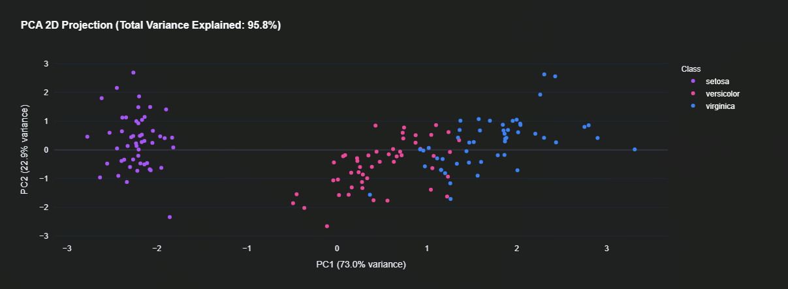

# 🚀 Universal ML Analytics Playground

An advanced interactive Machine Learning analytics platform built using Streamlit, Scikit-learn, and Plotly.

This project allows users to upload custom datasets, visualize patterns using PCA & 3D graphs, compare multiple ML algorithms, and generate real-time predictions through an elegant dashboard interface.

---

# ✨ Features

- 📂 Upload Custom CSV Datasets
- 🌸 Default Iris Flower Classification Support
- 📊 Interactive Data Visualization Dashboard
- 📈 PCA 2D Cluster Projection
- 🌐 3D Scatter Plot Visualization
- 🔥 Correlation Heatmap Analysis
- 🧠 Multiple Machine Learning Algorithms
- ⚡ Real-Time Hyperparameter Tuning
- 🏆 Live Model Ranking System
- 📉 Cross Validation Performance Analysis
- 🤖 Real-Time Prediction Panel
- 🌲 Feature Importance Visualization
- 📌 Confusion Matrix Heatmaps
- 📋 Classification Reports
- 🎨 Dynamic Theme Switching (Dark / Light)
- 🚀 Fully Deployable Streamlit Web Application

---

# 🏗️ Project Structure

```bash
Universal-ML-Analytics-Playground/

│── app.py
│── main.py
│── requirements.txt
│── README.md

│── screenshot/
│   ├── pca.png
│   ├── 3D scatter plot.png
│   ├── correlation heatmap.png
│   ├── performance matrix.png
│   ├── inspect and predict.png
│   ├── Model ranking and comparision.png

└── .gitignore
```

---

# 🛠️ Tech Stack

## Frontend / UI

- Streamlit — Interactive Web App Framework
- Plotly — Advanced Interactive Visualizations
- HTML/CSS — Custom UI Styling

## Machine Learning

- Scikit-learn — ML Algorithms & Pipelines
- PCA — Dimensionality Reduction
- Cross Validation — Model Evaluation

## Data Processing

- Pandas — Data Manipulation
- NumPy — Numerical Computation

---

# 📦 Installation

## Prerequisites

Make sure you have installed:

- Python 3.9 or higher
- pip

---

# ⚙️ Setup Instructions

## Clone Repository

```bash
git clone https://github.com/your-username/Universal-ML-Analytics-Playground.git
```

---

## Move Into Project Folder

```bash
cd Universal-ML-Analytics-Playground
```

---

## Install Dependencies

```bash
pip install -r requirements.txt
```

---

# 🚀 Running the Application

## Start Streamlit App

```bash
streamlit run app.py
```

---

## Open in Browser

```bash
http://localhost:8501
```

---

# 🧠 Supported Machine Learning Algorithms

The platform currently supports:

- K-Nearest Neighbors (KNN)
- Logistic Regression
- Decision Tree Classifier
- Random Forest Classifier
- Support Vector Machine (SVM)

---

# 📊 Visualization Modules

## PCA 2D Projection

Projects high-dimensional data into 2D space for cluster visualization.

## 3D Scatter Plot

Interactive 3D feature exploration.

## Parallel Coordinates Plot

Analyze feature patterns across classes.

## Correlation Heatmap

Identify linear relationships between features.

---

# 🏆 Model Evaluation Metrics

The application compares models using:

- Test Accuracy
- Cross Validation Accuracy
- Standard Deviation
- Training Time
- Confusion Matrix
- Precision
- Recall
- F1-Score

---

# 🤖 Live Prediction System

Users can:

- Adjust feature sliders dynamically
- Generate real-time predictions
- View prediction confidence scores
- Analyze model behavior instantly

---

# 🎨 UI Features

- 🌙 Space Dark Theme
- ☀️ Orchid Light Theme
- Responsive Dashboard Layout
- Animated Metric Cards
- Gradient UI Components
- Interactive Charts

---

# 📂 Custom Dataset Support

Users can upload their own CSV datasets and:

- Select target columns
- Choose feature columns
- Train models dynamically
- Generate predictions instantly

---

# 📸 Screenshots

## PCA Visualization



---

## 3D Scatter Plot


---

## Correlation Heatmap


---

## Model Ranking Dashboard


---

## Performance Matrix


---

## Inspect & Predict Panel


---

# 🌐 Deployment

This project can be deployed easily on:

- Streamlit Community Cloud
- Render
- Hugging Face Spaces
- Railway

---

# ☁️ Streamlit Deployment

## Deploy on Streamlit Cloud

1. Push project to GitHub
2. Open Streamlit Community Cloud
3. Select repository
4. Choose:

```bash
app.py
```

5. Click Deploy

---

# 📝 requirements.txt

```txt
streamlit
pandas
numpy
plotly
scikit-learn
```

---

# 🐛 Troubleshooting

## Module Not Found Error

Install dependencies again:

```bash
pip install -r requirements.txt
```

---

## Streamlit Not Starting

Run:

```bash
streamlit run app.py
```

---

## Port Already in Use

Restart terminal or stop existing Streamlit process.

---

# 🤝 Contributing

Contributions are welcome.

To contribute:

```bash
Fork the repository
Create a new branch
Commit changes
Push updates
Open Pull Request
```

---

# 📜 License

This project is created for educational and academic purposes.

---

# 👩‍💻 Developed By

Anushka Bakshi

Built with ❤️ using Streamlit, Scikit-learn & Plotly.
